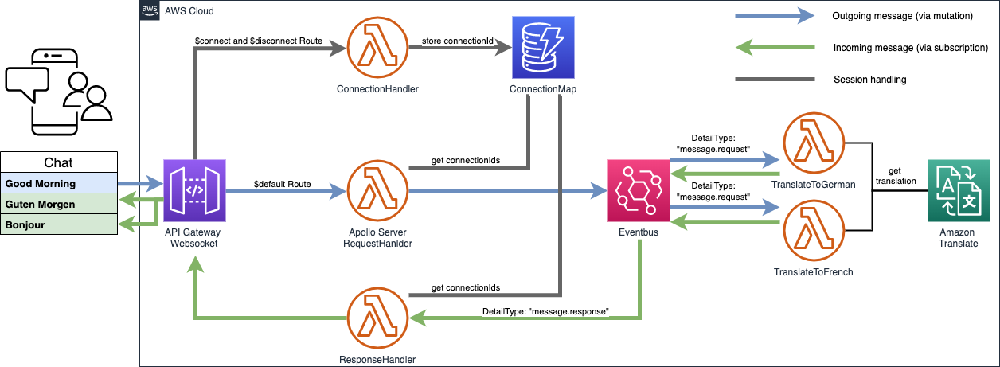

# Using Apollo Server on AWS Lambda with Amazon EventBridge for real-time, event-driven streaming

This repository contains the full source code that is used in the blog post [Using Apollo Server on AWS Lambda with Amazon EventBridge for real-time, event-driven streaming](https://aws.amazon.com/blogs/opensource/using-apollo-server-on-aws-lambda-with-amazon-eventbridge-for-real-time-event-driven-streaming/)

## Solution Overview



The diagram shows the architecture that is defined by the CDK code in this repository.

You can choose if you want to connect via REST or Websocket:
#### REST API
After you connect to the API Gateway you request is forwarded to the RequestHandler Lambda which includes the serverless Apollo GraphQL Server. Apollo evaluates the mutation or query and generates an answer with the provided resolver. The resolver puts the message in EventBridge. Subscriptions are not support via REST.
#### Websocket API
When you connect to the Websocket API the ConnectionHandler Lambda preserves the state of the connection in the ConnectionMap Dynamo Table. Mutation, query and subscription requests are handled via the Apollo GraphQL server. Subscription details are stored in the ConnectionMap table - the connection ID and the subscription chatId. As an example for an integration with an AWS service two different lambdas are invoked as soon as the EventBridge rule is triggered. They translate the content of the message into German and French via Amazon Translate and put them back into EventBridge. Another rule is triggered which invokes the Lambda ResponseHandler. The Lambda queries for all active subscriptions of a certain topic (in this example the chatId) in the ConnectionMap table and forwards the content of the event to those connections.


## Getting started

### Prerequisites
- AWS account
- Node.js v16
- git

### 1. Complete the prerequisites and clone this repo
```
git clone git@URL
```
### 2. Open the repository in your preferred IDE and familiarize yourself with the structure of the project.
```
.
├── cdk             CDK code that defines the environment
├── img             Images used in this README
└── src
    └── lambda    Handler code of the Lambda functions
```
### 3. Install dependencies
node.js dependencies are declared in a `package.json`.
This project contains a `package.json` file in two different folders:
- `cdk`: Dependencies required to deploy your stack with the CDK
- `src`: Dependencies that support app development, i.e. TypeScript types for the AWS SDK for JavaScript

Navigate to each folder and run `npm install`
### 4. Ensure AWS credentials are configured
### 5. Deploy your app
Navigate to the `cdk` folder and run the following commands

```
npx cdk bootstrap
npx cdk deploy
```

### 6. Try out

Subscribe to the chat with `chatId: chat` by sending the following message to `WebSocketApiEndpoint` via websocket.

```
{"query":"subscription Subscription {    
    chat(chatId: \"chat\")
}","variables":{}}
```

After that, send a new message to the REST API via GraphQL mutation by running the following cURL command.

```
curl --location --request POST '<YOUR_REST_API_ENDPOINT>' \
--header 'Content-Type: application/json' \
--data-raw '{"query":"mutation postMessage {\n  putEvent(message: \"Good Morning!\", chatId: \"chat\") { Entries { EventId } }\n}","variables":{}}'
```

Your messages will be translated to French and German and pushed backed to you over the websocket connection.

## Cleaning up

When you are done, make sure to clean everything up.

Run the following command to shut down the resources created in this workshop.

```
npx cdk destroy
```

## Security
See CONTRIBUTING for more information.

## License
This project is licensed under the MIT-0 License. See the LICENSE file.
